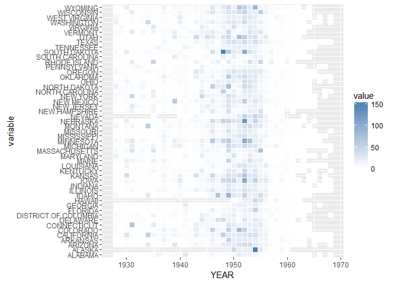

1928-1969間，小兒麻痺在美國各州的發生率變化
================

資料前處理
----------

``` r
polio<-read.csv("POLIO_Incidence.csv",stringsAsFactors = F)

library(reshape2)
```

    ## Warning: package 'reshape2' was built under R version 3.2.5

``` r
polio.m<-melt(polio,id.vars = c('YEAR','WEEK'))

polio.m[polio.m$value=="-",]$value<-NA 
polio.m$value<-as.numeric(as.character(polio.m$value)) 
polio.sumYear<- 
  aggregate(value~YEAR+variable,data=polio.m,FUN=sum,na.rm=F) 
head(polio.sumYear)
```

    ##   YEAR variable value
    ## 1 1928  ALABAMA  2.39
    ## 2 1929  ALABAMA  2.25
    ## 3 1930  ALABAMA  2.57
    ## 4 1931  ALABAMA  2.07
    ## 5 1932  ALABAMA  1.38
    ## 6 1933  ALABAMA  1.12

視覺畫呈現
----------

我們利用方塊圖的顏色深淺呈現三維座標的圖形。



圖中，縱軸為各城市的名字，橫軸為年分，圖中格子顏色越深(藍色)代表該年度該城市的小兒麻痺發生率為較高的年份，越淺色(白色)則是較低的小兒麻痺發生率。
